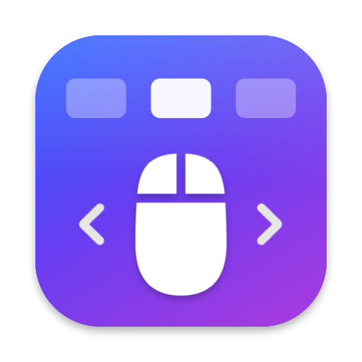

<div align="center">



# Mousip

**Switch Spaces with your mouse's tilt wheel, like swiping on a Magic Mouse.**


</div>

---

Mousip is a tiny menu bar app for mice with a tilting scroll wheel. Tilt the wheel right or left
and you move to the next or previous Space: desktops and full-screen apps alike.
Optionally, a middle click on an empty spot opens Mission Control.

Built for the **HP 480 Comfort Bluetooth Mouse**, it works with any mouse that reports wheel tilt
as horizontal scrolling (HID "AC Pan").

## ✨ Features

- **Tilt to switch Spaces.** One tilt is one Space, however many events the mouse sends.
- **Middle click for Mission Control** *(optional).* Only on empty spots: middle clicks on links,
  tabs, buttons and text keep working as usual.
- **Your shortcuts, respected.** Mousip posts the system "Move left/right a space" shortcuts,
  reading your custom bindings if you changed them.
- **Trackpads and Magic Mouse untouched.** Only notched scroll wheels are intercepted.
- **Sideways scrolling on demand.** Hold <kbd>⌥</kbd> while tilting to scroll horizontally as usual.

## 🚀 Install

You only need the Command Line Tools (Swift 6), not Xcode.

```sh
./build.sh install    # builds, copies to /Applications and launches
```

On first launch macOS asks for the **Accessibility** permission
(System Settings › Privacy & Security › Accessibility). As soon as you grant it, Mousip turns on by itself.

| Command | What it does |
| --- | --- |
| `./build.sh` | Builds `build/Mousip.app` |
| `./build.sh run` | Builds and launches from `build/` |
| `./build.sh install` | Builds, copies to `/Applications` and launches |

> [!NOTE]
> The build is signed ad-hoc, so every rebuild invalidates the Accessibility permission:
> `run` and `install` reset it (`tccutil reset Accessibility com.mousip.app`) and the app asks again.
> To keep it across rebuilds, sign with a stable certificate:
> `SIGN_IDENTITY="Certificate name" ./build.sh install`.

## 🖱️ The menu

Click the Mousip icon (three side-by-side panels) in the menu bar.

| Item | |
| --- | --- |
| **Enabled** | Pauses or resumes everything. The icon turns gray while paused. |
| **Invert Direction** | For when tilting right takes you left. |
| **Repeat While Held** | Keeps switching Spaces every 0.45 s while the wheel stays tilted. |
| **Middle Click for Mission Control** | Opens Mission Control on a middle click on an empty spot. Off by default. |
| **Launch at Login** | Starts Mousip when you log in. |

If something needs your attention (missing permission, disabled shortcuts) a ⚠︎ item at the top
takes you straight to the right settings page.

**Hold <kbd>⌥</kbd> while opening the menu** for the extras:

- **Test** › Space Left / Space Right / Mission Control: checks the shortcuts without the mouse.
- **Debug Logging**: logs every scroll event and every middle click target. To read it:

  ```sh
  log stream --predicate 'subsystem == "com.mousip.app"'
  ```

## 🪟 Middle click for Mission Control

A middle click often means something: open a link in a new tab, close a tab, paste in a terminal.
So Mousip asks the Accessibility API what's under the cursor and steps in only if it's empty space:

| Under the cursor | Middle click |
| --- | --- |
| Link, tab, button, menu, Dock icon, text field | Passed to the app as usual |
| Page background, plain text, window background, desktop | Opens Mission Control |
| Anything, with <kbd>⌘</kbd> <kbd>⇧</kbd> <kbd>⌥</kbd> or <kbd>⌃</kbd> held | Passed to the app as usual |
| An app that doesn't answer | Passed to the app as usual |

Middle **drags** (panning a canvas in Figma, Blender, maps…) are recognized after a few points of
movement and replayed to the app, so they keep working.

> [!TIP]
> Chrome and Electron apps build their web accessibility tree only when asked. While the option is on,
> Mousip asks them to (`AXManualAccessibility`), otherwise a link would look like an empty spot.

## ⚙️ How it works

1. A `CGEventTap` intercepts scroll events. Only **horizontal** events from notched
   scroll wheels (`isContinuous == 0`) are considered: trackpads and the Magic Mouse are left alone.
2. A burst of events from the same tilt counts as a single gesture
   (0.3 s pause between one gesture and the next).
3. For each gesture it posts the Mission Control shortcut "Move left/right a space"
   (<kbd>⌃←</kbd> / <kbd>⌃→</kbd> by default), read from `com.apple.symbolichotkeys`.
4. Handled horizontal events are consumed, so apps don't scroll sideways.
   With <kbd>⌥</kbd> (or <kbd>⇧</kbd>) held, they pass through untouched.
5. A second tap watches the middle button. On press it hit-tests the element under the cursor
   (`AXUIElementCopyElementAtPosition`) and walks up its ancestors looking for something clickable.
   If there's nothing, it swallows the click and opens Mission Control on release
   (by launching `Mission Control.app`, so it works whatever shortcut is assigned to it).

## 🩺 Troubleshooting

| Symptom | Likely cause |
| --- | --- |
| Nothing happens, the icon is grayed out | The Accessibility permission is missing, or the one from the previous build is still listed: remove it, add it again and restart the app. |
| "Test" doesn't switch Spaces | The "Move left/right a space" shortcuts are disabled (Keyboard › Keyboard Shortcuts › Mission Control). |
| A single tilt skips several Spaces | The mouse repeats the event at intervals longer than 0.3 s: increase `gestureGap` in `ScrollInterceptor.swift`. |
| The log never shows a non-zero `h=` | The mouse doesn't report tilt as horizontal scrolling (for example it sends buttons 4/5 instead). |
| A middle click on a link opens Mission Control | The app doesn't expose that link to Accessibility. Enable Debug Logging to see the element roles under the cursor, and add the missing role to `interactiveRoles` in `MiddleClickInterceptor.swift`. |
| A middle click on an empty spot does nothing | The app didn't answer in time, or the spot is inside a clickable element: check the log. |

## 🗂️ Project structure

```
Sources/Mousip/
├── AppDelegate.swift             menu bar icon, menu and permissions
├── EventTap.swift                shared CGEventTap wrapper
├── ScrollInterceptor.swift       tilt filtering and grouping into gestures
├── MiddleClickInterceptor.swift  middle click → Mission Control, with the Accessibility hit test
├── SpaceSwitcher.swift           reading and posting the system shortcuts
└── Settings.swift                preferences (UserDefaults)
Resources/
├── AppIcon.icns, icon.png        generated by scripts/make-icon.swift
└── Info.plist
```

To redraw the icon after editing `scripts/make-icon.swift`:

```sh
swift scripts/make-icon.swift
```
